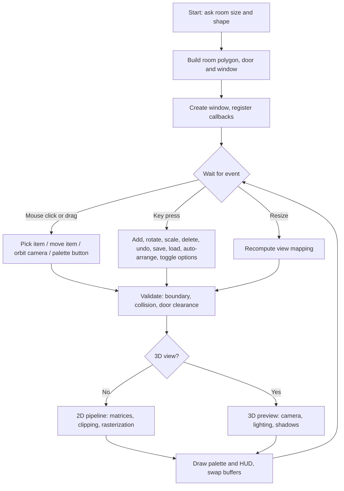
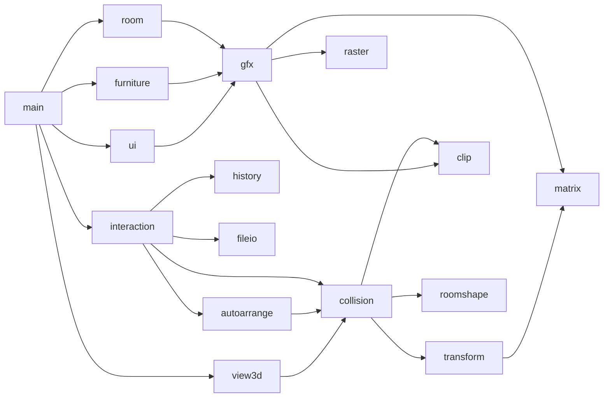

# SmartRoom: Interactive Computer Graphics-Based 2D Room and Furniture Layout Planner

**A Computer Graphics Course Project Report**

> **How to use this draft:** text in `[square brackets]` is a placeholder for you to fill in (names, dates, your test results, screenshots). Everything else is written from the actual project. Read each section once and change any sentence that does not match what you built or what your examiner expects.

---

## Title Page

| | |
|---|---|
| **Project title** | SmartRoom: Interactive Computer Graphics-Based 2D Room and Furniture Layout Planner |
| **Course** | Computer Graphics |
| **Submitted by** | [Pranav Kangude], [Registration number(PRN) :- 1251010510] |
| **Programme and semester** | [B.Tech, branch:- AI & DS, semester :- 3] |
| **Guide** | [Prof. Neha Rajas] |
| **Department** | [AIDS] |
| **Institution** | [VIT , PUNE] |
| **Academic year** | [2026 – 2027] |

---

## Certificate

This is to certify that the project entitled **"SmartRoom: Interactive Computer Graphics-Based 2D Room and Furniture Layout Planner"** is a bonafide work carried out by **[Your full name]** ([Roll number]) in partial fulfilment of the requirements of the course **Computer Graphics** during the academic year **[20XX – 20XX]**, under my guidance.

&nbsp;

Guide: [Name, signature, date] &nbsp;&nbsp;&nbsp;&nbsp;&nbsp; Head of Department: [Name, signature, date]

---

## Acknowledgement

I would like to thank my guide **[Guide's name]** for guidance and encouragement throughout this project, the **[Department name]** for the laboratory facilities, and my friends and family for their support. I also acknowledge the authors of the textbooks and the FreeGLUT/OpenGL communities, whose documentation made this work possible.

[Pranav Kangude]

---

## Table of Contents

1. Abstract
2. Introduction
3. Problem Statement and Objectives
4. Literature Survey and Existing Systems
5. System Requirements
6. System Design
7. Implementation
8. Results and Screenshots
9. Testing
10. Conclusion and Future Scope
11. References
12. Appendix A: User Guide and Controls
13. Appendix B: Build Instructions and Project Structure

---

## 1. Abstract

SmartRoom is an interactive room and furniture layout planner developed in C++ with OpenGL (FreeGLUT). The user defines a rectangular or L-shaped room to scale, places furniture from a palette, and rearranges it with the mouse and keyboard. The 2D plan is produced by a graphics pipeline written for this project: 3x3 homogeneous transformation matrices, Liang-Barsky line clipping, Sutherland-Hodgman polygon clipping, DDA and Bresenham line drawing, and scanline polygon filling. Boundary and collision detection use the Separating Axis Theorem and a polygon test, so invalid placements are shown in red and rejected. Door-swing clearance, snap-to-grid, undo/redo, zoom and pan, and save/load improve usability. A rule-based auto-arrange feature proposes a sensible layout, and a 3D preview with an orbit camera, lighting and projected shadows shows the same room in perspective. The project is organised into 17 source modules (about 2,100 lines of code) and is supported by automated unit tests and a 98-case test plan. It demonstrates practical use of line and polygon drawing, geometric transformations, window-to-viewport mapping, clipping, collision detection and event-driven programming.

**Keywords:** computer graphics, OpenGL, 2D transformations, clipping, rasterization, collision detection, room layout planner.

---

## 2. Introduction

Arranging furniture in a room is a common real-world problem. People usually try it on paper or by physically moving heavy objects, which is slow, tiring and error-prone. SmartRoom is an interactive application that lets a user define a room, place furniture in it, and see the result instantly.

The project applies core Computer Graphics ideas to this practical problem: 2D primitives, geometric transformations, clipping, collision detection, event-driven interaction and real-time rendering. It is similar in spirit to commercial room planners but is deliberately small, so that every graphics concept used can be studied and explained.

A distinguishing choice in this project is that the 2D drawing does **not** rely on OpenGL's matrix stack, line rasterizer or polygon filler. OpenGL is used as a surface that plots pixels, while the transformation, clipping and rasterization algorithms are implemented in the project's own code. The 3D preview, in contrast, uses OpenGL's perspective projection and lighting to show how the same scene looks with depth.

---

## 3. Problem Statement and Objectives

### 3.1 Problem statement

Planning a room layout without visualization leads to wasted space, blocked doors and poorly placed furniture. There is a need for a lightweight, interactive tool that lets a user design a room to scale, place and transform furniture, and check whether the layout is valid, all before moving anything physically.

### 3.2 Objectives

1. Build an interactive 2D top-down room planner using computer graphics techniques.
2. Draw a room to scale from user-defined dimensions, for both rectangular and L-shaped rooms.
3. Provide a library of common furniture (bed, sofa, table, chair, wardrobe, desk) plus a door and a window, drawn with graphics primitives.
4. Let users add, select, move, rotate, scale and delete furniture interactively.
5. Detect collisions and boundary violations so furniture cannot overlap or leave the room.
6. Offer a grid, snap-to-grid, undo/redo, zoom and pan, and save/load of layouts.
7. Implement the core algorithms (transformations, clipping, line drawing, polygon filling) in the project's own code.
8. Provide a rule-based auto-arrange suggestion and a 3D preview as extensions.

### 3.3 Scope

**In scope:** 2D top-down plan, rectangular and L-shaped rooms, a fixed furniture set, mouse and keyboard interaction, layout save/load, rule-based auto-arrange, and a 3D preview.

**Out of scope:** textures, realistic furniture models, multi-room floor plans, AI-based layout generation, curved or arbitrary-polygon rooms.

---

## 4. Literature Survey and Existing Systems

Several tools already help people plan interiors. A short comparison, from the point of view of this project's goals, is given below. *[Check each tool's current features on its website before submitting, and add the access dates to your references.]*

| Tool | Type | Strengths | Limitations for this project's purpose |
|---|---|---|---|
| IKEA home planning tools | Online planner tied to a product catalogue | Large catalogue of real products, easy for shoppers | Closed system; the graphics techniques are hidden; limited to the vendor's products |
| Roomstyler | Online 2D/3D room design tool | Quick 3D visualization, shareable designs | Web service; no access to the algorithms; depends on an online catalogue |
| SketchUp | General-purpose 3D modelling software | Very flexible modelling for architecture and interiors | Steep learning curve; far more general than a simple layout check |

**Gap addressed:** these tools are polished products, but none of them exposes the underlying graphics algorithms. SmartRoom is a small, transparent planner in which transformation, clipping, rasterization and collision detection are written out and can be demonstrated.

**Concepts from the course used here:** line-drawing algorithms (DDA, Bresenham), polygon filling, 2D transformations in homogeneous coordinates, window-to-viewport mapping, line and polygon clipping, hit testing, and double-buffered interactive rendering. Additional ideas from outside the basic syllabus are the Separating Axis Theorem (collision), point-in-polygon testing, planar shadow projection, and simple lighting in OpenGL.

---

## 5. System Requirements

### 5.1 Hardware

| Item | Minimum |
|---|---|
| Processor | Any dual-core CPU |
| Memory | 2 GB RAM |
| Display | 1000 x 700 pixels or larger |
| Graphics | Any GPU with OpenGL 1.1 or later support |
| Input | Mouse with a wheel (recommended) and keyboard |

### 5.2 Software

| Item | Used in this project |
|---|---|
| Operating system | Windows (also builds on Linux) |
| Language | C++ (C++11) |
| Compiler | MinGW g++ |
| Graphics library | OpenGL with FreeGLUT 3.8.0 |
| Editor | Visual Studio Code |
| Version control | Git and GitHub |
| Diagrams | draw.io / Mermaid |

---

## 6. System Design

### 6.1 Overall architecture

The program is an event-driven application. FreeGLUT delivers mouse and keyboard events to the Interaction module, which changes the layout data. After every change the scene is redrawn, either as a 2D plan through the project's own pipeline or as a 3D preview through OpenGL.



### 6.2 Modules

| Module | Files | Responsibility |
|---|---|---|
| Application | `main.cpp` | Window setup, start-up prompts, display and reshape callbacks |
| Shared data | `common.h`, `state.cpp` | `Furniture` and `Vec2` types, global state |
| Room shape | `roomshape.h/.cpp` | Room outline polygon (rectangle or L), floor rectangles, area, centroid, door and window positions |
| Transformation | `matrix.h/.cpp`, `transform.h/.cpp` | 3x3 matrices, model and view matrices, picking, window-to-viewport mapping, zoom and pan |
| Clipping | `clip.h/.cpp` | Liang-Barsky and Sutherland-Hodgman |
| Rasterization | `raster.h/.cpp` | DDA, Bresenham, scanline polygon fill |
| Drawing pipeline | `gfx.h/.cpp` | Local coordinates, matrix, clip, rasterize; rectangles, ellipses, text |
| Room drawing | `room.h/.cpp` | Floor, grid, walls, door, window, dimension labels |
| Furniture | `furniture.h/.cpp` | Furniture sizes, colours and drawing |
| Collision | `collision.h/.cpp` | Boundary check, SAT overlap, door-swing clearance |
| Interaction | `interaction.h/.cpp` | Mouse, wheel and keyboard callbacks |
| History | `history.h/.cpp` | Undo and redo |
| File | `fileio.h/.cpp` | Save and load layouts |
| UI | `ui.h/.cpp` | Furniture palette and heads-up display |
| 3D view | `view3d.h/.cpp` | Perspective camera, lighting, 3D models, shadows |
| Auto-arrange | `autoarrange.h/.cpp` | Rule-based layout |



### 6.3 Data structures

```cpp
struct Furniture {
    int   type;       // BED, SOFA, TABLE, CHAIR, WARDROBE, DESK
    float x, y;       // centre position (world units = feet)
    float w, h;       // width and height before rotation
    float angle;      // rotation in degrees
    float col[3];     // base RGB colour
};
struct Mat3 { float m[3][3]; };           // homogeneous 2D transformation
std::vector<Furniture> items;             // the current layout
std::vector<Vec2>      roomPoly;          // room outline, counter-clockwise
std::vector<RectF>     floorRects;        // outline split into 1 or 2 rectangles
```

Undo and redo are two stacks of complete layout snapshots (up to 100 steps).

### 6.4 Coordinate systems and pipeline

Three coordinate systems are used:

1. **Local space:** the origin is the centre of a furniture piece, and its shape is defined here.
2. **World space:** the room, in feet, with the origin at the bottom-left corner.
3. **Screen space:** pixels in the window, with the origin at the bottom-left.

For every drawn vertex the pipeline computes `screen = View x Model x local`, clips the result against the canvas, and rasterizes it.


### 6.5 User interface

The window has a **furniture palette** on the left (six furniture buttons plus Undo, Redo, Save, Load, Clear and Auto-arrange), a **canvas** for the plan or the 3D view, and a **heads-up display** on top showing the room, item count, free floor area, zoom, option states and the controls. The selected item's name, size, angle and position are shown at the bottom.

---

## 7. Implementation

### 7.1 Homogeneous matrices and composite transformations

Points are written as column vectors `[x y 1]^T`, so translation, rotation and scaling are all matrix products:

```
        | 1 0 tx |          | cos t  -sin t  0 |          | sx 0 0 |
T(tx,ty)= | 0 1 ty |  R(t) =  | sin t   cos t  0 |  S(sx,sy)= | 0 sy 0 |
        | 0 0 1  |          |   0       0    1 |          | 0  0 1 |
```

Two composite matrices drive the whole program:

- **Model matrix** of a furniture piece: `M = T(x, y) * R(angle)`. The shape is drawn around the origin, so rotation happens about the item's own centre.
- **View matrix:** `V = T(offX, offY) * S(scale)`, which converts feet to pixels with zoom and pan included.

Rotation about an arbitrary point `c` is the composite `T(c) * R(t) * T(-c)`, equal to the formula
`x' = cx + (x - cx)cos t - (y - cy)sin t`, `y' = cy + (x - cx)sin t + (y - cy)cos t`.

The inverse of a 3x3 matrix is computed with the determinant and adjugate. It is used for **picking** (see 7.4) and for **mouse-to-world conversion**: `world = V^-1 * (mouseX, windowHeight - mouseY)`.

### 7.2 Window-to-viewport mapping, zoom and pan

The room is fitted into the canvas with `scale = min(availableWidth / roomW, availableHeight / roomL)`, and centred. The user's zoom multiplies this scale and the user's pan adds to the offset. Zooming with the wheel keeps the world point under the cursor fixed: the new offset is chosen so that `V' * w = mouse` for the same world point `w`.

### 7.3 Line drawing: DDA and Bresenham

Both algorithms produce a list of pixels for a line from `(x0, y0)` to `(x1, y1)`; OpenGL only plots them.

**DDA:** `steps = max(|dx|, |dy|)`, then `x += dx/steps`, `y += dy/steps` in each step, rounding to the nearest pixel.

**Bresenham (integer-only, all octants):**
```
dx = |x1-x0|, dy = |y1-y0|, sx = sign(x1-x0), sy = sign(y1-y0), err = dx - dy
loop: plot(x0,y0); if (x0,y0)==(x1,y1) stop
      e2 = 2*err
      if e2 > -dy: err -= dy, x0 += sx
      if e2 <  dx: err += dx, y0 += sy
```
The user can switch between OpenGL lines, DDA and Bresenham with the `B` key to compare them. Thick lines (walls) are drawn by plotting each pixel as a square point of the required size.

### 7.4 Picking with the inverse model matrix

To test whether the mouse is on a rotated item, the mouse point is converted to world coordinates and then to the item's local space: `p_local = M^-1 * p_world`. In local space the item is an axis-aligned rectangle centred at the origin, so the test is simply `|x| <= w/2 and |y| <= h/2`. Items are tested from the top of the draw order downwards, so the visible item wins.

### 7.5 Clipping

**Liang-Barsky line clipping.** A segment `P(u) = P0 + u(P1 - P0)`, `0 <= u <= 1`, is clipped against a window by four inequalities `p_k u <= q_k` with
`p = (-dx, dx, -dy, dy)` and `q = (x0 - xmin, xmax - x0, y0 - ymin, ymax - y0)`.
For each edge the algorithm updates the entering parameter `u1 = max(0, q/p for p<0)` and the leaving parameter `u2 = min(1, q/p for p>0)`; if `u1 > u2` the line is rejected. The clipped end points are `P0 + u1(P1-P0)` and `P0 + u2(P1-P0)`.

**Sutherland-Hodgman polygon clipping.** The polygon is clipped against the left, right, bottom and top window edges in turn. For each polygon edge `S -> E` there are four cases: both inside (output E), entering (output intersection and E), leaving (output intersection), both outside (output nothing).

In the program, every line and polygon is clipped to the canvas, so zoomed or panned geometry never paints over the palette or the text area. The key `K` turns this on or off to demonstrate the effect.

### 7.6 Scanline polygon fill

Polygons (floor, furniture, translucent door zone) are filled with an even-odd scanline algorithm. For each pixel row, taken through the pixel centres at `y + 0.5`, the intersections with all polygon edges are computed and sorted, and the pixels between pairs of intersections are filled. The result is a list of horizontal spans that OpenGL draws as thin rectangles. The key `F` switches to OpenGL's own polygon fill for comparison.

### 7.7 Collision detection and boundary check

**Furniture against furniture: Separating Axis Theorem.** Two convex shapes do not overlap if there is an axis on which their projections are separated. For two (possibly rotated) rectangles the candidate axes are the two edge directions of each rectangle, four axes in total. The corners of both rectangles are projected onto each axis; if the intervals `[minA, maxA]` and `[minB, maxB]` do not overlap on any axis, the rectangles are apart. A small tolerance (0.001 ft) lets items touch without being treated as overlapping.

**Furniture against the room: polygon test.** Checking only that the four corners lie inside the room is not enough for an L-shaped room, because a rotated item can have all corners inside while its edge cuts across the inner corner. The boundary check therefore has two parts:

1. The item's centre must be inside the room polygon (ray-casting point-in-polygon test).
2. No wall (polygon edge) may pass through the inside of the item. Each wall is transformed into the item's local space with the inverse model matrix and clipped against the item's rectangle (slightly shrunk) using **Liang-Barsky**. If any part of a wall remains, the wall cuts through the item, so the placement is invalid.

If both conditions hold, the whole rectangle is inside the room. The same function works for rectangular rooms.

**Door-swing clearance.** The area swept by the door is a quarter circle of radius 3 ft around the hinge. It is sampled on a 0.25 ft grid, and each sample is converted into the item's local space and tested against its rectangle. Any hit means the item blocks the door and is shown as invalid.

**Feedback.** Invalid items are drawn in red. If a drag ends in an invalid place, the item returns to its previous position and the undo step is discarded.

### 7.8 Room shapes (rectangular and L-shaped)

The room is stored as a counter-clockwise polygon, plus the same area split into one or two rectangles (used for floor and grid drawing). An L-shaped room is a rectangle with a notch cut from any one of the four corners. From the polygon the program computes the **area** and **centroid** with the shoelace formulas, and the extents of the bottom and top walls, which decide where the door (1.5 ft from the start of the bottom wall) and the window (centred on the top wall) go; a wall shorter than 6 ft gets neither. The key `N` cycles through the five shapes.

### 7.9 Interaction

| Event | Action |
|---|---|
| Left click on an item | Select it (blue outline) and bring it to the front |
| Left drag | Move the selected item, with snap-to-grid `x = round(x / 0.5) * 0.5` |
| Keys `R` / `E` | Rotate by 90 / 15 degrees about the centre |
| Keys `+` / `-` | Scale by about 10 percent within 1 to 12 ft |
| `X` / Delete | Remove the selected item |
| Wheel, right-drag, arrows | Zoom, pan |
| Palette buttons | Add furniture and run Undo, Redo, Save, Load, Clear, Auto-arrange |

### 7.10 Undo, redo, save and load

Before each change a copy of the layout is pushed on the undo stack. Undo restores the last snapshot and moves the current one onto the redo stack; any new action clears the redo stack. The layout is saved as plain text (`layout.txt`):

```
SMARTROOM 2
roomW roomL notchW notchL notchCorner
itemCount
type x y w h angle        (one line per item)
```
Loading validates the header, the ranges and every number, so a corrupted file is rejected without changing the current layout. Version 1 files (without a notch) can still be loaded.

### 7.11 Rule-based auto-arrange

Auto-arrange re-places all furniture with a greedy algorithm and no AI. Items are placed in priority order: bed, wardrobe, sofa, desk, table, chairs. For each item the program generates candidate positions, removes invalid ones, and chooses the candidate with the best score:

| Item | Candidates | Score favours |
|---|---|---|
| Bed | Headboard against any wall | Far from the door |
| Wardrobe | Back against any wall | Close to a room corner, not in front of the window |
| Sofa | Back against any wall | Centred on the wall, not on the door wall, long walls |
| Desk | Back against any wall | Close to the window |
| Table | Any position on a 0.5 ft grid | Close to the centre of the room |
| Chair | In front of the desk first, then around the table, then along a wall | Facing the desk or table |

A candidate is valid when it is inside the room, outside the door-swing zone and not overlapping (with a spacing margin) the items already placed. The algorithm tries margins of 0.6, 0.25 and 0 ft in turn. If some item still cannot be placed, the original layout is kept and a message is shown. The result is one undo step. Walls are the edges of the room polygon, so the same code works for L-shaped rooms.

### 7.12 3D preview

Pressing `V` switches to a 3D view of the same layout, rendered with OpenGL's fixed-function pipeline:

- **Camera:** a perspective projection (40 degree field of view) and an orbit camera around the room's centroid. With yaw `y`, pitch `p` and distance `d`, the eye is at `centre + d * (cos p cos y, cos p sin y, sin p)`, looking at the centre with the z axis up. Dragging changes yaw and pitch, and the wheel changes the distance.
- **Models:** each furniture piece is built from boxes and cylinders in the same local axes as the 2D drawing (for example bed with mattress, pillows and headboard; sofa with backrest and arms; table with a pedestal; wardrobe with doors and handles).
- **Room:** floor, cutaway walls (3.5 ft high so the interior stays visible), a door gap with an open door leaf, a window with translucent glass, and the door-swing zone. Walls are generated from the polygon edges.
- **Lighting:** one positional light with ambient and diffuse components, per-face normals and smooth shading.
- **Shadows:** a **planar projection matrix** flattens each model onto the floor from the light position `L` onto the plane `n . x + d = 0`:
  `M = (n . L + d * Lw) * I - L * n^T` (written with the plane `(a, b, c, d)`). Shadows are drawn as translucent black, and OpenGL clip planes keep them inside each floor rectangle so none falls into the notch of an L-shaped room.

The 3D view is for viewing; editing is done in the 2D plan, and the palette and keyboard commands still work while the 3D view is shown.

---

## 8. Results and Screenshots

*[Insert your screenshots here. Suggested file names from your `screenshots` folder are shown; change them to match your files. Keep each caption.]*

| Figure | Description | File |
|---|---|---|
| Fig. 8.1 | Empty room with grid, walls, door swing arc and window | `screenshots/01_empty_room.png` |
| Fig. 8.2 | Room with several pieces of furniture placed | `screenshots/02_furniture_placed.png` |
| Fig. 8.3 | Invalid placement shown in red (overlap or blocked door) | `screenshots/03_invalid_red.png` |
| Fig. 8.4 | Selected item (blue outline) and zoomed view | `screenshots/04_selected_zoomed.png` |
| Fig. 8.5 | Rotated furniture | `screenshots/05_rotated_items.png` |
| Fig. 8.6 | Palette and dimension labels | `screenshots/06_palette_dimensions.png` |
| Fig. 8.7 | Selected-item information line | `screenshots/07_selected_info.png` |
| Fig. 8.8 | 3D preview with lighting and shadows | `screenshots/08_3d_view.png` |
| Fig. 8.9 | 3D preview from another angle | `screenshots/09_3d_other_angle.png` |
| Fig. 8.10 | Line algorithms: Bresenham versus OpenGL lines | `screenshots/10_render_modes.png` |
| Fig. 8.11 | Layout before auto-arrange | `screenshots/11_before_autoarrange.png` |
| Fig. 8.12 | Layout after auto-arrange | `screenshots/12_after_autoarrange.png` |
| Fig. 8.13 | L-shaped room with wall dimensions | `[your file]` |
| Fig. 8.14 | 3D view of an L-shaped room | `[your file]` |
| Fig. 8.15 | Auto-arrange in an L-shaped room | `[your file]` |

Example of inserting an image in Markdown:

```

```

**Discussion of results.** *[Write 4 to 6 sentences in your own words: the program runs at interactive speed, every operation gives instant visual feedback, invalid layouts are always caught, auto-arrange produced valid layouts in the scenarios you tried, and so on.]*

---

## 9. Testing

### 9.1 Test strategy

Testing used three levels:

1. **Algorithm unit tests** for the code that does not depend on OpenGL: matrices, clipping, line drawing and scanline fill (15 checks), and room geometry, boundary check, door and window placement (36 checks). They are small stand-alone programs in the `tests` folder.
2. **Functional and interactive tests** of the application: a written plan of 98 cases with expected results.
3. **Logic tests during development** of auto-arrange (valid layouts in several room shapes), save/load (including old and corrupted files), and the shadow projection matrix (checked numerically against a ray-plane intersection).

### 9.2 Unit tests

| Test file | Covers | Checks | Result |
|---|---|---|---|
| `tests/test_algorithms.cpp` | Matrix inverse and rotation, Liang-Barsky, Sutherland-Hodgman, DDA, Bresenham, scanline fill | 15 | [ALL PASSED / details] |
| `tests/test_room.cpp` | Area and centroid of the five room shapes, point-in-polygon, boundary check including the tilted item at the inner corner, door and window in every orientation | 36 | [ALL PASSED / details] |

### 9.3 Functional test plan

| Section | Area | Number of tests | Passed | Failed |
|---|---|---|---|---|
| 1 | Room setup | 6 | [ ] | [ ] |
| 2 | Adding furniture | 5 | [ ] | [ ] |
| 3 | Selecting and moving | 6 | [ ] | [ ] |
| 4 | Transformations | 6 | [ ] | [ ] |
| 5 | Validation (boundary, collision, door) | 8 | [ ] | [ ] |
| 6 | Undo, redo, save, load | 11 | [ ] | [ ] |
| 7 | View (zoom, pan) | 6 | [ ] | [ ] |
| 8 | Palette | 3 | [ ] | [ ] |
| 9 | Stress and performance | 3 | [ ] | [ ] |
| 10 | Rendering pipeline | 7 | [ ] | [ ] |
| 11 | 3D preview | 11 | [ ] | [ ] |
| 12 | Auto-arrange | 10 | [ ] | [ ] |
| 13 | L-shaped rooms | 16 | [ ] | [ ] |
| | **Total** | **98** | [ ] | [ ] |

*[Fill the Passed and Failed columns from your completed `Testing.md` and `Testing_new_features.md`. You can attach the full tables as an appendix.]*

### 9.4 Problems found and how they were solved

| Problem | Cause | Solution |
|---|---|---|
| `glutMouseWheelFunc` was reported as undefined and the new features did not appear | It is a FreeGLUT extension declared in `freeglut.h`, not `glut.h`; the build failed and the old program kept running | Include `<GL/freeglut.h>` |
| Compiler received `.8.0/freeglut/include` and failed | PowerShell split the folder name `freeglut-mingw-3.8.0` at the dot | Quote the include and library options |
| Linker error `undefined reference to WinMain@16` | `main.cpp` was empty when compiled | Paste the full source and save before compiling |
| Windows refused to run the compiled program ("Application Control policy") | Security policy on the machine blocked the specific executable file | Build under a new output file name |
| Boundary check could accept an item that cut across the inner corner of an L-shaped room | The four-corner test does not detect a wall passing through an item | Replaced by the centre-inside test plus a wall-versus-rectangle test using Liang-Barsky |
| *[Add any problems you found during your own testing]* | | |

### 9.5 Known limitations

- The round table uses its bounding rectangle for collision.
- The door-swing check samples the swept quarter circle on a 0.25 ft grid, so it is an approximation.
- Rooms are rectangular or L-shaped with one axis-aligned notch; the door is on the bottom wall and the window on the top wall.
- Auto-arrange is a greedy rule-based method; it is not optimal and can fail in very tight rooms.
- Undo restores the furniture, not the room shape or size.
- The 3D view is for viewing only, and its shadows are hard-edged planar shadows.

---

## 10. Conclusion and Future Scope

### 10.1 Conclusion

SmartRoom turns core computer graphics theory into a practical, visual and interactive tool. The project meets its objectives: the user can define a rectangular or L-shaped room to scale, place and transform furniture, and receive immediate feedback when a placement is invalid. The 2D drawing is built on algorithms implemented in the project itself (homogeneous matrices, Liang-Barsky and Sutherland-Hodgman clipping, DDA and Bresenham lines, scanline fill), which makes the link between theory and result visible. Collision detection with the Separating Axis Theorem, a polygon boundary test, door-swing clearance, undo/redo, save/load, rule-based auto-arrange and a lit 3D preview with shadows complete a usable planner. The modular design (17 source files, about 2,100 lines) and the automated tests make the code easy to explain, test and extend.

### 10.2 Future scope

- Textures and richer 3D furniture models, and walkthrough camera in the 3D view
- Editing directly in 3D (picking in a perspective view)
- A drag-and-drop catalogue with custom sizes and more furniture types
- Rooms with arbitrary polygon outlines, curved walls, and multi-room floor plans
- Smarter layout suggestions (scoring with several rules, or search-based optimization)
- Export to image or PDF, and a web or mobile version (for example with WebGL or HTML5 Canvas)

---

## 11. References

*[Use the reference style your department requires (IEEE, APA, etc.), and check the edition and year against the books in your library.]*

1. D. Hearn, M. P. Baker and W. Carithers, *Computer Graphics with OpenGL*, Pearson.
2. J. D. Foley, A. van Dam, S. K. Feiner and J. F. Hughes, *Computer Graphics: Principles and Practice*, Addison-Wesley.
3. D. Shreiner et al., *OpenGL Programming Guide* ("The Red Book"), Addison-Wesley.
4. J. E. Bresenham, "Algorithm for computer control of a digital plotter," *IBM Systems Journal*, vol. 4, no. 1, 1965.
5. Y.-D. Liang and B. A. Barsky, "A new concept and method for line clipping," *ACM Transactions on Graphics*, vol. 3, no. 1, 1984.
6. I. E. Sutherland and G. W. Hodgman, "Reentrant polygon clipping," *Communications of the ACM*, vol. 17, no. 1, 1974.
7. FreeGLUT project documentation, https://freeglut.sourceforge.net/ *[accessed: date]*
8. OpenGL documentation, https://www.opengl.org/ *[accessed: date]*
9. IKEA, Roomstyler and SketchUp websites for the existing-systems survey *[add exact URLs and access dates]*
10. Source code repository: https://github.com/[your-username]/SmartRoom-Interactive-Graphics-

---

## Appendix A: User Guide and Controls

| Action | Input |
|---|---|
| Add furniture (bed, sofa, table, chair, wardrobe, desk) | Palette buttons, or keys `1` to `6` |
| Select / move | Left-click, drag |
| Rotate 90 / 15 degrees | `R` / `E` |
| Scale selected item | `+` / `-` |
| Delete selected item | `X` or Delete |
| Clear room | `C` or the Clear button |
| Auto-arrange all furniture | `A` or the Auto-arrange button |
| Undo / redo | `U` / `Y` (or `Ctrl+Z` / `Ctrl+Y`) |
| Save / load layout | `S` / `L` |
| Zoom | Mouse wheel, or `Z` / `O` |
| Pan | Right-mouse drag, or arrow keys |
| Reset view | `0` |
| Toggle snap-to-grid | `G` |
| Toggle door-swing zone | `D` |
| Toggle dimension labels | `M` |
| Cycle room shape (rectangle, L-shaped in four orientations) | `N` |
| 2D plan / 3D preview | `V` |
| 3D: orbit / zoom / reset camera | Left-drag or arrows / wheel / `0` |
| Line algorithm: OpenGL / DDA / Bresenham | `B` |
| Polygon fill: own scanline / OpenGL | `F` |
| Clip scene to viewport on / off | `K` |
| Quit | `Esc` |

## Appendix B: Build Instructions and Project Structure

**Windows (MinGW and FreeGLUT):** extract the FreeGLUT MinGW package into the project folder, copy `libfreeglut.dll` next to the program, then run `build.bat`, or:

```
g++ main.cpp state.cpp roomshape.cpp matrix.cpp clip.cpp raster.cpp gfx.cpp transform.cpp collision.cpp furniture.cpp room.cpp history.cpp fileio.cpp ui.cpp interaction.cpp view3d.cpp autoarrange.cpp -o smartroom_v7.exe "-Ifreeglut-mingw-3.8.0/freeglut/include" "-Lfreeglut-mingw-3.8.0/freeglut/lib" -lfreeglut -lopengl32 -lglu32
```

**Linux:** `sudo apt install build-essential freeglut3-dev`, then the same source list with `-lGL -lGLU -lglut`.

**Project size:**

| Item | Count |
|---|---|
| Source files (`.cpp`) | 17 |
| Header files (`.h`) | 16 |
| Lines of code (application) | about 2,100 |
| Lines of test code | about 165 |

**Largest modules (lines):** `view3d.cpp` 337, `interaction.cpp` 239, `autoarrange.cpp` 200, `main.cpp` 124, `gfx.cpp` 122, `room.cpp` 120.
